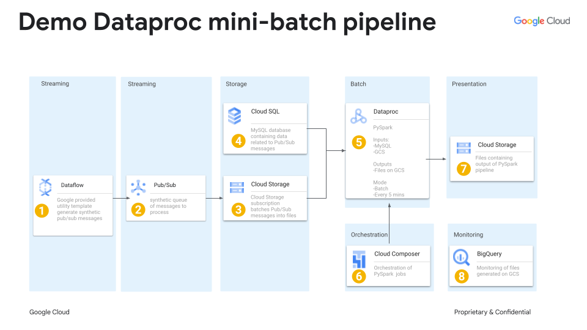

# demo-dataproc-pipeline



table of contents: 

  0. [Common GCP Components](#0-common-gcp-components) 
  1. [Dataflow](#1-dataflow---cerating-synthetic-pubsub-messages-for-the-simulation)
  2. [Pub/Sub](#2-pubsub---queue-of-messages-to-process)
  3. [GCS Storage](#3-gcs---batching-of-pubsub-messages-into-files)
  4. [CloudSQL](#4---cloudsql-instance-creation)
  5. [Dataproc](#5-dataproc)
  6. [Composer](#6-cloud-composer)
  7. [GCS Presentation](#7-gcs---presentation-layer-with-pipeline-output)
  8. [BigQuery](#8-bigquery)

## 0 Common GCP Components

### 0.1 check gcloud is on the right project

```sh
gcloud config configurations list
```

```sh
gcloud config configurations activate ${name_of_config}
```

### 0.2 Environmetal variables

To help build GCP infra, Create some evironmental variables as follows.

```sh
export GCP_PROJECT_ID=$(gcloud config list core/project --format="value(core.project)")
export GCP_PROJECT_NUM=$(gcloud projects describe $GCP_PROJECT_ID --format="value(projectNumber)")
export GCP_REGION="europe-west2"
export DEMO_NAME=demo-dataproc-pipeline
export GCS_BUCKET=gs://${GCP_PROJECT_ID}-${DEMO_NAME}
export GCS_BUCKET_NO_PREFIX=${GCP_PROJECT_ID}-${DEMO_NAME}
export GCS_SUBSCRIPTION_ID=projects/${GCP_PROJECT_ID}/subscriptions/${GCS_PUB_SUB_SUBSCRIPTION}
export PUB_SUB_TOPIC=projects/${GCP_PROJECT_ID}/topics/${DEMO_NAME}
export DEBUG_PUB_SUB_SUBSCRIPTION=demodataprocpipelinedebug
export DEBUG_SUBSCRIPTION_ID=projects/${GCP_PROJECT_ID}/subscriptions/${DEBUG_PUB_SUB_SUBSCRIPTION}
export GCS_PUB_SUB_SUBSCRIPTION=demodataprocpipelinegcs
export EMAIL_ADDRESS="YOU@DOMAIN.COM"
export TS_FORMAT=%Y-%m-%dT%H:%M:%SZ
export PUB_SUB_SA="service-${GCP_PROJECT_NUM}@gcp-sa-pubsub.iam.gserviceaccount.com"
export MYSQL_MVN_GROUP_ID="mysql"
export MYSQL_MVN_ARTIFACT="mysql-connector-java"
export MYSQL_MVN_VERSION="8.0.32"
export JDBC_JAR="gs://python-lab-329118-demo-dataproc-pipeline/mysql-connector-j-8.1.0.jar"
export CSQL_JAR="gs://python-lab-329118-demo-dataproc-pipeline/mysql-socket-factory-1.13.1.jar"
export DB_USER="YOUR_USERNAME"
export DB_PASS="YOUR_PASSWORD"
export COMPOSER_IMAGE_VERSION="composer-2.4.4-airflow-2.5.3"
```

### 0.3 enable GCP product apis

check which apis are currently enabled for your project by running

```sh
gcloud services list --enabled
```

If required, enable the dataproc, compute engine & cloud storage APIs

```sh
gcloud services enable dataproc.googleapis.com
gcloud services enable compute.googleapis.com
gcloud services enable storage-component.googleapis.com
gcloud services enable composer.googleapis.com
```

## 1 Dataflow - Cerating synthetic pub/sub messages for the simulation

This google provided template is used to create fake data.

https://cloud.google.com/dataflow/docs/guides/templates/provided/streaming-data-generator#gcloud

As we are generating pub/sub messages a JSON schema needs to be provided.

```js
{"id": {{integer(0,1000)}},"name": "{{uuid()}}","isInStock": {{bool()}}}
```

Note how the JSON is all one 1 line, this is so when we batch messages together in
a single file we can have a file in [jsonlines](https://jsonlines.org/) format

Next upload our JSON schema into the GCS bucket

```sh
gcloud storage cp synth_data_schema.json ${GCS_BUCKET}
```
with the schema uploaded to gcs, a template can be kicked off later to generate data.

```sh
gcloud dataflow flex-template run demo-dataproc-gen-synth-pubsub-msgs \
    --project=${GCP_PROJECT_ID} \
    --region=${GCP_REGION} \
    --template-file-gcs-location=gs://dataflow-templates-${GCP_REGION}/latest/flex/Streaming_Data_Generator \
    --parameters \
sinkType=PUBSUB,\
topic=${PUB_SUB_TOPIC},\
schemaLocation=${GCS_BUCKET}/synth_data_schema.json,\
outputType=JSON,\
qps=5,\
messagesLimit=100
```

## 2 Pub/Sub - queue of messages to process

create a topic.

```sh
gcloud pubsub topics create ${PUB_SUB_TOPIC}
```

Create a subscription to this topic for debugging purposes
```sh
gcloud pubsub subscriptions create ${DEBUG_PUB_SUB_SUBSCRIPTION} \
--topic=${PUB_SUB_TOPIC} \
--retain-acked-messages
```

Check that pub/sub messages were create successfully by dataflow template.
N.B. This command will pull messages without acknowledgement.

```sh
gcloud pubsub subscriptions pull ${DEBUG_PUB_SUB_SUBSCRIPTION} \
--format=json \
--limit=10
```

## 3 GCS - batching of Pub/Sub messages into files

These pub/sub messages will be batched into files on GCS, so let's create a bucket.

```sh
gcloud storage buckets create ${GCS_BUCKET} \
  --project=${GCP_PROJECT_ID} \
  --location=${GCP_REGION} \
  --uniform-bucket-level-access
```

Create a Cloud Storage [subscription](https://cloud.google.com/pubsub/docs/create-cloudstorage-subscription#pubsub_create_cloudstorage_subscription-gcloud)
to consume pub/sub messages, batch them & write their contents as files on GCS.

As a prereq, the Pub/Sub service account must have permission to write to the specific 
Cloud Storage bucket and to read the bucket metadata.

```sh
gcloud storage buckets add-iam-policy-binding ${GCS_BUCKET} \
--member="serviceAccount:${PUB_SUB_SA}" \
--role="roles/storage.objectCreator"

gcloud storage buckets add-iam-policy-binding ${GCS_BUCKET} \
--member="serviceAccount:${PUB_SUB_SA}" \
--role="roles/storage.legacyBucketReader"
```

Disable the requester pays setting on the GCS bucket

```sh
gsutil requesterpays set off ${GCS_BUCKET}
```

Finally, execute this command to create the Cloud Storage Subscription.

```sh
gcloud pubsub subscriptions create ${GCS_PUB_SUB_SUBSCRIPTION} \
--topic=${PUB_SUB_TOPIC} \
--cloud-storage-bucket=${GCS_BUCKET_NO_PREFIX} \
--cloud-storage-file-prefix=YOUR_FILE_PREFIX \
--cloud-storage-file-suffix=.jsonl \
--cloud-storage-max-duration=5m \
--cloud-storage-output-format=text \
--cloud-storage-write-metadata
```

check bacthing of pub/sub messages & writing of files to GCS

```sh
gcloud storage ls ${GCS_BUCKET}
```

Use cloud monitoring to measure the progress of the cloud storage subscription

https://cloud.google.com/pubsub/docs/monitoring#maintain_a_healthy_subscription

Use pub/sub UI to measure progress of cloud storage subscription

https://cloud.google.com/pubsub/docs/monitor-subscription


## 4 - Cloudsql instance creation

Create a MySQL DB on a CloudSQL instance as per [docs](https://cloud.google.com/sql/docs/mysql/create-instance#gcloud)

```sh
gcloud sql instances create ${DEMO_NAME} \
--database-version=MYSQL_8_0 \
--cpu=2 \
--memory=7680MB \
--region=${GCP_REGION}
```

connect to this database

```sh
gcloud sql connect ${DEMO_NAME} --user=root --quiet
```

create a database

```sh
CREATE DATABASE guestbook;
```

create a table in this database & insert some data into the table

```sh
USE guestbook;
CREATE TABLE entries (guestName VARCHAR(255), content VARCHAR(255),
    entryID INT NOT NULL AUTO_INCREMENT, PRIMARY KEY(entryID));
    INSERT INTO entries (guestName, content) values ("first guest", "I got here!");
INSERT INTO entries (guestName, content) values ("second guest", "Me too!");
```

check the newly created data is in the table

```sh
SELECT * FROM entries;
```

## 5. Dataproc

### 5.1 cluster creation

Create a dataproc cluster with (cloud-sql-proxy)[https://github.com/GoogleCloudDataproc/initialization-actions/tree/master/cloud-sql-proxy#using-this-initialization-action-without-configuring-hive-metastore] 
installed on all Dataproc worker nodes

```sh
gcloud dataproc clusters create ${DEMO_NAME}-2 \
    --region ${GCP_REGION} \
    --scopes sql-admin \
    --initialization-actions gs://goog-dataproc-initialization-actions-${GCP_REGION}/cloud-sql-proxy/cloud-sql-proxy.sh \
    --metadata "enable-cloud-sql-hive-metastore=false" \
    --metadata "additional-cloud-sql-instances=${GCP_PROJECT_ID}:${GCP_REGION}:${DEMO_NAME}"
```

### 5.2 pyspark GCS

Using legacy RDD programming API

```sh
gcloud dataproc jobs submit pyspark rdd_read_text_from_gcs.py \
    --cluster=${DEMO_NAME}-1 \
    --region=${GCP_REGION} \
    -- gs://${GCS_BUCKET_NO_PREFIX}/input/ gs://${GCS_BUCKET_NO_PREFIX}/output/
```

Using newer Dataset API

```sh
gcloud dataproc jobs submit pyspark dataset_read_json_from_gcs.py \
    --cluster=${DEMO_NAME}-1 \
    --region=${GCP_REGION}
```

### 5.3 pyspark MySQL

Download the jdbc driver JAR 

https://dev.mysql.com/doc/connector-j/8.1/en/

https://mvnrepository.com/artifact/com.mysql/mysql-connector-j/8.1.0

Upload it to GCS

```sh
gcloud storage cp mysql-connector-j-8.1.0.jar ${GCS_BUCKET}
```

Use it in the launch of a dataproc jobs

```sh
gcloud dataproc jobs submit pyspark dataset_read_from_cloudsql_mysql.py \
    --cluster=dataproc-cloudsql-cluster-1 \
    --region=europe-west2 \
    --jars=${JDBC_JAR}
```

## 6 Cloud Composer

Create a cloud composer 2 environment, by following [docs](https://cloud.google.com/composer/docs/composer-2/run-apache-airflow-dag)

Add Cloud Composer Service Agent account as a new principal on your environment's 
service account (the project's default compute service account to) and grant the 
Cloud Composer v2 API Service Agent Extension (roles/composer.ServiceAgentV2Ext) 
role to it.

```sh
gcloud iam service-accounts add-iam-policy-binding \
    ${GCP_PROJECT_NUM}-compute@developer.gserviceaccount.com \
    --member serviceAccount:service-${GCP_PROJECT_NUM}@cloudcomposer-accounts.iam.gserviceaccount.com \
    --role roles/composer.ServiceAgentV2Ext
```

Actually create the cloud composer environment

```sh
gcloud composer environments create ${DEMO_NAME} \
  --location ${GCP_REGION} \
  --image-version ${COMPOSER_IMAGE_VERSION}
```

View perinstalled python packages in the composer environment. [docs](https://cloud.google.com/composer/docs/composer-2/install-python-dependencies#view-packages)

```sh
gcloud beta composer environments list-packages \
   ${DEMO_NAME} \
    --location ${GCP_REGION}
```


Upload Airflow DAG to cloud storage

```sh
gcloud composer environments storage dags import \
--environment ${DEMO_NAME} \
--location ${GCP_REGION} \
--source dataproc_orchestrator.py
```

## 7 GCS - presentation layer with pipeline output

Output of PySpark pipeline is on GCS, let's create a bucket of it.

```sh
gcloud storage buckets create \
  --project=${GCP_PROJECT_ID} \
  --location=${GCP_REGION} \
  --uniform-bucket-level-access
```

### 8 BigQuery

Use BigQuery to monitor the files produed by the pipeline at various stages.

setup a BigQuery BigLake table for the JSON files stored on GCS

https://cloud.google.com/bigquery/docs/create-cloud-storage-table-biglake

query this BigLake table to answer if a given YYYY/MM/DD/hh/mm/ combo had orders